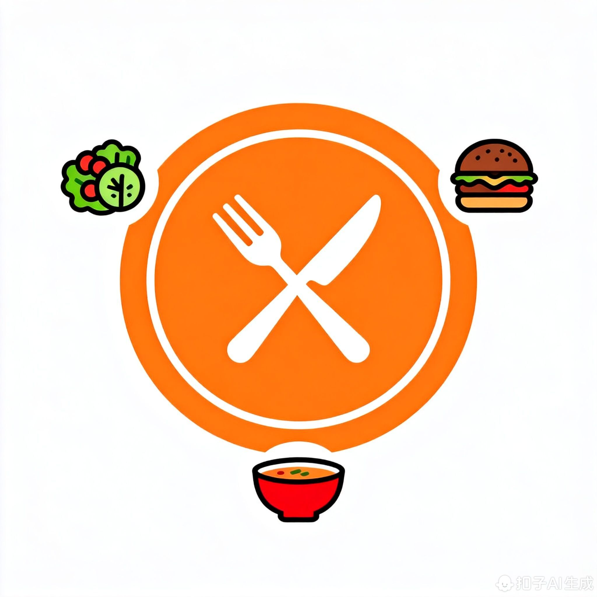
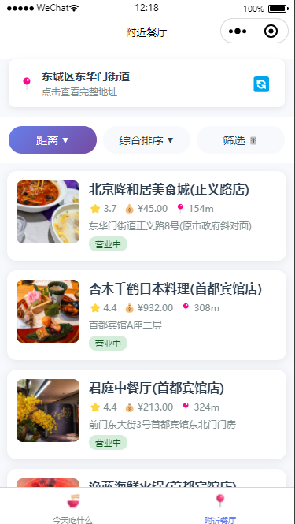
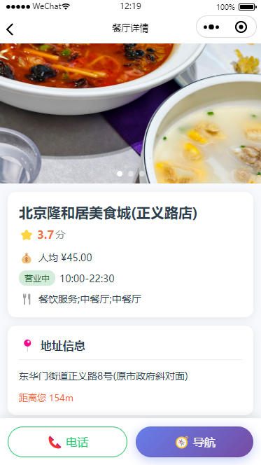

# 🍜 今天吃什么 - What to Eat Today

<div align="center">



**一款帮助解决选择困难症的智能美食推荐小程序**

[](LICENSE)
[](https://uniapp.dcloud.io/)
[](https://github.com/yourusername/what-to-eat-today/pulls)

[在线演示](#) | [功能特性](#功能特性) | [快速开始](#快速开始) | [截图预览](#截图预览)

</div>

---

## 📖 项目简介

**今天吃什么**是一款基于 uni-app + Vue 3 开发的跨平台小程序，旨在帮助用户快速决定每日饮食。通过智能时段识别和随机推荐算法，让"吃什么"不再成为难题。同时集成高德地图 API，提供周边餐厅查询功能，让美食触手可及。

### 💡 为什么选择这个项目？

- 🎯 **解决痛点**：针对日常生活中的"选择困难症"
- 🎨 **现代化设计**：遵循最新 UI/UX 设计规范
- 🚀 **技术前沿**：Vue 3 Composition API + uni-app 跨平台
- 📱 **多端支持**：一套代码，支持微信小程序、H5、App
- 🔧 **开箱即用**：完整的项目结构和详细文档

---

## ✨ 功能特性

### 🍽️ 智能美食推荐

- **⏰ 智能时段识别**

  - 自动识别早餐(06:00-09:59)、午餐(10:00-13:59)、晚餐(14:00-20:59)、夜宵(21:00-05:59)
  - 根据不同时段推荐相应的美食分类
  - 动态渐变背景，营造不同时段氛围

- **🎲 随机推荐算法**

  - 从 200+ 美食数据库中智能筛选
  - 支持"换一换"功能，无限刷新
  - "不想吃"排除功能，避免重复推荐

- **📜 历史记录**
  - 记录最近 10 次推荐
  - 快速重选历史美食
  - 横向滚动，优雅展示

### 📍 附近餐厅查询

- **🗺️ 基于地理位置**

  - 调用高德地图 API
  - 实时获取用户位置
  - 智能逆地理编码，显示详细地址

- **🔍 多维度筛选**

  - 距离范围：1km / 3km / 5km
  - 餐厅类型：中餐、西餐、火锅、烧烤、快餐
  - 价格区间：实惠 ≤50 / 中档 50-100 / 高档 100-200 / 豪华 ≥200
  - 评分筛选：4.5 分+ / 4.0 分+ / 3.5 分+
  - 排序方式：距离优先 / 综合排序

- **📋 餐厅信息展示**
  - 餐厅名称、评分、人均消费、距离
  - 详细地址、营业状态
  - 支持一键拨号、导航到店

### 🎨 精美 UI 设计

- **渐变色主题**：根据时段切换背景色
- **流畅动画**：3D 翻转、渐变过渡
- **响应式布局**：适配各种屏幕尺寸
- **毛玻璃效果**：现代化视觉体验
- **震动反馈**：增强交互体验

---

## 🛠️ 技术栈

| 技术                                                                       | 说明                   | 版本         |
| -------------------------------------------------------------------------- | ---------------------- | ------------ |
| [uni-app](https://uniapp.dcloud.io/)                                       | 跨平台框架             | 最新         |
| [Vue 3](https://vuejs.org/)                                                | 渐进式 JavaScript 框架 | ^3.0.0       |
| [Composition API](https://vuejs.org/guide/extras/composition-api-faq.html) | Vue 3 组合式 API       | -            |
| [高德地图 API](https://lbs.amap.com/)                                      | 地图服务               | Web 服务 API |
| [Sass](https://sass-lang.com/)                                             | CSS 预处理器           | -            |

---

## 📦 快速开始

### 环境要求

- Node.js >= 14.0.0
- HBuilderX (推荐最新版本)
- 微信开发者工具 (如需编译微信小程序)

### 安装步骤

1. **克隆项目**

```bash
git clone https://github.com/yourusername/what-to-eat-today.git
cd what-to-eat-today
```

2. **安装依赖**

```bash
npm install
```

3. **配置高德地图 Key**

在 `utils/mapApi.js` 中替换你的高德地图 API Key：

```javascript
const AMAP_KEY = "你的高德地图Key";
```

> 💡 获取 Key：前往 [高德开放平台](https://lbs.amap.com/) 注册并创建应用

4. **运行项目**

**方式一：使用 HBuilderX**

- 用 HBuilderX 打开项目
- 点击运行 -> 运行到内置浏览器/小程序模拟器

**方式二：使用命令行**

```bash
# H5
npm run dev:h5

# 微信小程序
npm run dev:mp-weixin

# App
npm run dev:app
```

5. **编译发布**

```bash
# 编译 H5
npm run build:h5

# 编译微信小程序
npm run build:mp-weixin

# 编译 App
npm run build:app
```

---

## 📂 项目结构

```
what-to-eat-today/
├── pages/                   # 页面文件
│   ├── index/              # 首页-美食推荐
│   │   └── index.vue
│   ├── nearby/             # 附近餐厅
│   │   └── nearby.vue
│   └── detail/             # 餐厅详情
│       └── detail.vue
├── utils/                   # 工具函数
│   ├── foodData.js         # 美食数据
│   ├── timeUtils.js        # 时间工具
│   └── mapApi.js           # 地图 API
├── static/                  # 静态资源
│   ├── images/             # 图片资源
│   └── logo.png            # Logo
├── doc/                     # 文档
│   └── AI开发提示词-今天吃什么小程序.md
├── App.vue                  # 应用入口
├── main.js                  # 主入口文件
├── manifest.json            # 应用配置
├── pages.json              # 页面配置
├── uni.scss                # 全局样式
├── package.json            # 依赖配置
└── README.md               # 项目说明
```

---

## 📸 截图预览

### 首页 - 美食推荐

<div align="center">
  
  
  
</div>

### 附近餐厅

<div align="center">
  
  
  
</div>

---

## 🔧 配置说明

### 权限配置

在 `manifest.json` 中配置小程序权限：

```json
{
  "mp-weixin": {
    "permission": {
      "scope.userLocation": {
        "desc": "你的位置信息将用于获取附近餐厅"
      }
    },
    "requiredPrivateInfos": ["getLocation"]
  }
}
```

### 服务器域名配置

在微信小程序后台配置以下域名：

- **request 合法域名**：`https://restapi.amap.com`

---

## 🎯 路线图

- [x] 基础功能开发
  - [x] 智能美食推荐
  - [x] 附近餐厅查询
  - [x] 餐厅详情展示
- [x] UI/UX 优化
  - [x] 现代化设计
  - [x] 流畅动画效果
  - [x] 响应式布局
- [ ] 增强功能
  - [ ] 用户收藏功能
  - [ ] 分享功能
  - [ ] 美食百科
  - [ ] AI 智能推荐
- [ ] 性能优化
  - [ ] 数据缓存
  - [ ] 图片懒加载
  - [ ] 骨架屏优化
- [ ] 多端适配
  - [ ] H5 端优化
  - [ ] App 端适配
  - [ ] 支付宝小程序

---

## 🤝 贡献指南

欢迎贡献代码！请遵循以下步骤：

1. Fork 本仓库
2. 创建特性分支 (`git checkout -b feature/AmazingFeature`)
3. 提交更改 (`git commit -m 'Add some AmazingFeature'`)
4. 推送到分支 (`git push origin feature/AmazingFeature`)
5. 开启 Pull Request

### 贡献者

感谢所有贡献者的付出！

<a href="https://github.com/yourusername/what-to-eat-today/graphs/contributors">
  
</a>

---

## 📄 开源协议

本项目采用 [MIT](LICENSE) 协议开源。

---

## 💬 联系方式

- **问题反馈**：[Issues](https://github.com/yourusername/what-to-eat-today/issues)
- **功能建议**：[Discussions](https://github.com/yourusername/what-to-eat-today/discussions)
- **邮箱**：your.email@example.com

---

## ⭐ Star History

[](https://star-history.com/#yourusername/what-to-eat-today&Date)

---

<div align="center">

**如果这个项目对你有帮助，请给一个 ⭐️ Star 支持一下！**

Made with ❤️ by [Your Name](https://github.com/yourusername)

</div>
